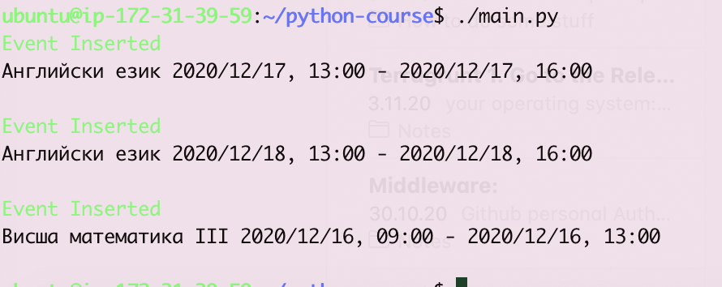
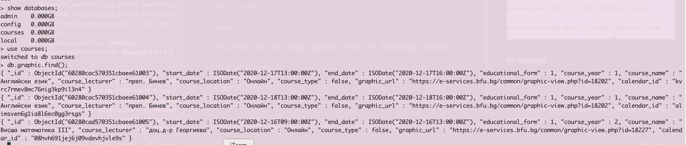
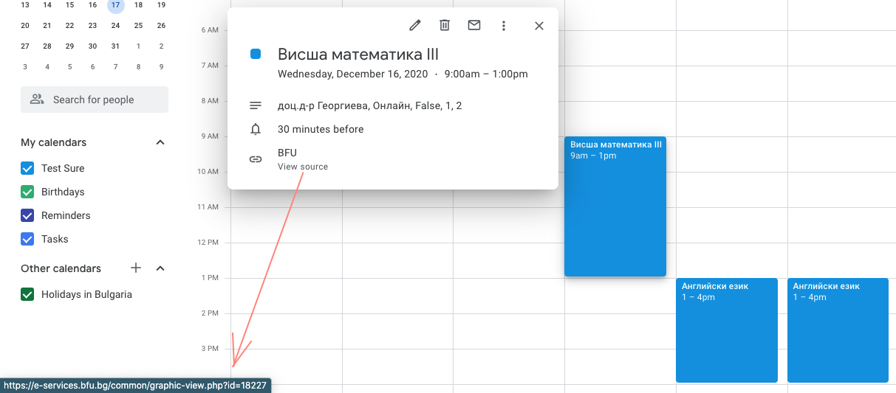

# BSU Calendar integration with Google Calendar

## Prerequisites

### Install mongo locally
Select your os and [install mongo](https://docs.mongodb.com/manual/tutorial/install-mongodb-on-ubuntu/)

### Create a project in [Google Developer Console](https://console.developers.google.com/)
Example initial settings for the project creation in Google Developer Console:
```
Name: BSU Calendar Automation
Location: use the default "No organisation"
```

### In project dashboard enable Google Calendar API

### Set up OAuth Consent Screen tab
* Go to OAuth Consent Screen and set the required fields for the initial screen and move the next one, which is Scopes
* In scopes, select all scopes regarding Google Calendar and move to the next screen, which is Test Users
* In Test Users, add the user with which you would like to test the app and move to the next screen, which is Summary, 
* Review summary to make sure test users and correct scopes have been added successfully

### Set up Credentials
* From project dashboard got to Credentials and create OAuth client ID. Example settings: 
```
Application Type: Web application 
Name: python 
Authorized JavaScript origins: http://localhost:8000 
Authorized redirect URIs: http://localhost:8000 
```
* Save and click the download button on the newly created OAuth client ID
* Rename the downloaded file to credentials.json and save it in the project folder

### Install requirements
```
pip install -r requirements.txt
```

### Setup config for which courses to be synced
Setup in config.yml the courses you would like to sync from BSU calendar to your Google calendar

| Field             | Value                           |
| ----------------- | ------------------------------- |
| educational_form  | 1 -> regular <br> 2 -> distance |
| course_year       | year                            |

> Note: the courses need to be in bulgarian and to be the same exact name as in the BSU portal calendar

## Start application
In console type:
```
python main.py
```

### Authenticate application
Once the app asks you to open a link, copy the link, paste in browser and authenticate the google account you have listed as test user in the Developer console.
After you give access to the app in Google -> copy the link from the browser (it will start http://localhost:8000 as the configuration you did in the Google developer console) and curl the link another terminal window (different from the onw you started the process with). Make sure you put double quotes around the link when you curl it.
> :heavy_check_mark: *The authentication will be saved only on your local machine. Also, you can revoke the access later from your profile settings.

## Expected Result

### Console output:


### In mongo
```
mongo
```
This will open the mongo console. Type the following commands:
```
show databases;
use courses;
graphic.find();
exit
```


### In Google Calendar

